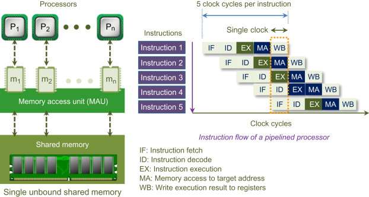
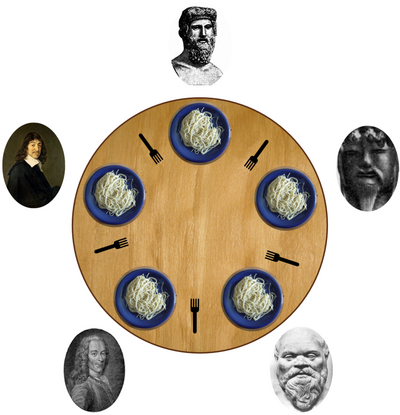
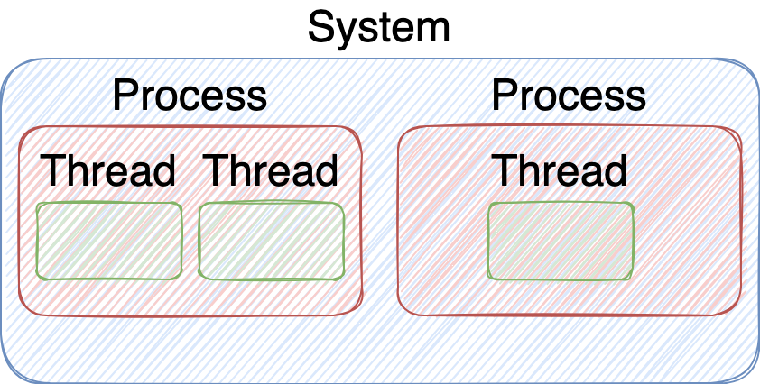
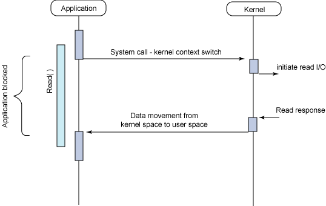
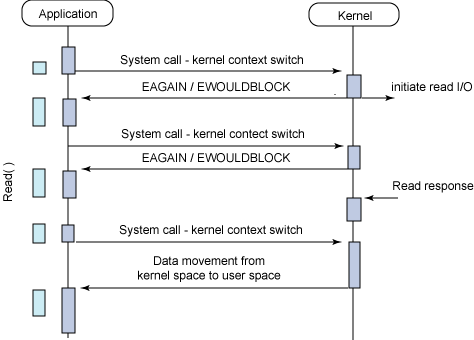
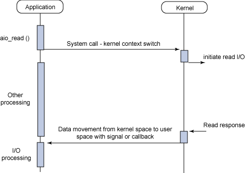
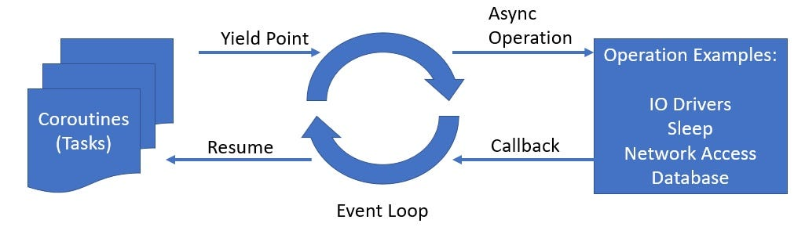

<!-- .slide: class="title" -->

# FastAPI Seminar

## Week 4: Asyc FastAPI

By: 이민규

---

# 출석 체크

## https://areyouhere.today/ <!-- .element: style="position: absolute; top: 50%; left: 50%; transform: translate(-50%, -50%)" -->

---

# Table of Contents

<br/>

0. 과제 2 리뷰
1. 동시성 프로그래밍
2. 코루틴
3. FastAPI
4. SQLAlchemy

---

<!-- .slide: class="section-title" data-auto-animate -->

# 0. 과제 2 리뷰

---

<!-- .slide: data-auto-animate -->

# 0. 과제 2 리뷰

---

<!-- .slide: class="section-title" data-auto-animate -->

# 1. 동시성 프로그래밍

---

<!-- .slide: data-auto-animate -->

# 1. 동시성 프로그래밍

## 병렬(Parallelism)

- 두 개 이상의 명령어가 동시에 실행되는 것
- 여기서 명령어란, CPU가 실행할 수 있는 최소 단위의 명령어를 의미한다.

---

<!-- .slide: class="image-slide" data-auto-animate -->

 <!-- .element: style="width: 100%; height: 100%" -->

---

<!-- .slide: data-auto-animate -->

# 1. 동시성 프로그래밍

## 동시(Concurrency)

- 두 개 이상의 작업이 동시에 실행되는 것
- 작업은 여러 개의 명령어로 이루어져 있으며, 이 명령어들이 동시에 실행되는 것을 의미하는 것이 아니다.
- 각 명령어들이 순서에 관계 없이, 혹은 부분적인 순서만을 가지고 실행되는 것을 의미한다.
- 예컨데, 와팡 서버에 2개의 주문 취소 요청이 동시에 들어왔을 때, 동시성을 지원하는 서버에서는 아래와 같이 처리하는 것이 가능하다.
  1. 요청 1의 주문 찾기 (요청1 / 명령어1)
  2. 요청 2의 주문 찾기 (요청2 / 명령어1)
  3. 요청 1의 주문 상태 -> CANCELED로 변경 (요청1 / 명령어2)
  4. 요청 2의 주문 상태 -> CANCELED로 변경 (요청2 / 명령어2)

---

# 1. 동시성 프로그래밍

## 동시성 문제

<div style="display:flex">

 <!-- .element style="height: 90%" -->

- 5명의 철학자가 원형 테이블에서 식사 중
- 이 음식은 반드시 2개의 포크를 사용
- 단순한 알고리즘
  - 왼쪽 포크가 사용 가능할 때까지 생각하기 <!-- .element: class="fragment" -->
  - 왼쪽 포크 집어들기 <!-- .element: class="fragment" -->
  - 오른쪽 포크가 사용 가능할 때까지 생각하기 <!-- .element: class="fragment" -->
  - 오른쪽 포크 집어들기 <!-- .element: class="fragment" -->
  - 일정 시간 동안 먹기 <!-- .element: class="fragment" -->
  - 왼쪽 포크 내려놓기 <!-- .element: class="fragment" -->
  - 오른쪽 포크 내려놓기 <!-- .element: class="fragment" -->

</div>

---

# 1. 동시성 프로그래밍

## 동시성 문제

<div style="display:flex">

 <!-- .element style="height: 90%" -->

- 단순한 알고리즘대로라면, 모두가 왼쪽 포크를 집어든 순간 교착 상태가 발생
- 단순한 해결책 : 플라톤만 오른쪽 포크 먼저 집기 <!-- .element: class="fragment" -->
- 나머지 4명의 철학자가 왼쪽 포크를 집었을 때, 플라톤은 오른쪽 포크를 집지 못하므로 교착 상태에 빠지지 않음 <!-- .element: class="fragment" -->

</div>

---

<!-- .slide: data-auto-animate -->

# 1. 동시성 프로그래밍

## Process와 Thread



---

<!-- .slide: data-auto-animate -->

# 1. 동시성 프로그래밍

## I/O

- Input / Output
- 디스크 읽기/쓰기, 소켓 읽기/쓰기 등 외부 시스템과의 통신
- I/O 자체는 커널에서 수행되며, Inturrupt 등으로 해당 작업의 완료를 알려줌

---

<!-- .slide: data-auto-animate -->

# 1. 동시성 프로그래밍

## Blocking I/O



- I/O 작업이 커널에서 완료될 때까지 기다림
- 해당 I/O 작업을 요청한 스레드는 그 동안 Block

---

<!-- .slide: data-auto-animate -->

# 1. 동시성 프로그래밍

## Non-Blocking I/O



- I/O 작업이 완료되는 걸 기다리지 않음
- I/O 작업이 완료됐는지 계속 확인해야 함 (Polling)

---

<!-- .slide: data-auto-animate -->

# 1. 동시성 프로그래밍

## Asynchronous I/O



- I/O 작업이 완료되는 걸 기다리지 않음
- I/O 작업이 완료됐는지 확인할 필요 없이 커널에서 시그널을 통해 알려줌
- 완료됐을 때 수행할 작업을 등록 (Callback)

---

<!-- .slide: data-auto-animate -->

# 1. 동시성 프로그래밍

## Asynchronous I/O

- Non-Blocking I/O가 있다면, Asynchronous I/O를 "구현"할 수 있음
- 별도의 I/O전용 스레드를 만들고, I/O 작업 발생 시 해당

---

<!-- .slide: class="section-title" data-auto-animate -->

# 2. 코루틴

---

<!-- .slide: data-auto-animate -->

# 2. 코루틴

## 서브루틴(Subroutine)

- 프로그램의 호출 가능한 단위 (≈ 메서드, 함수, 프로시저)
- 서브루틴을 호출하면, 해당 서브루틴이 끝나기까지 호출자(Caller)는 대기한다.
- 서브루틴은 고유한 스택 프레임을 갖는다.

---

<!-- .slide: data-auto-animate -->

# 2. 코루틴

## 코루틴(Coroutine)

- 코루틴은 중단/재개 가능한 서브루틴 (Non-preemptive Scheduling)
- 경량 스레드라고도 불린다.
- 동작이나 구현에 따라 여러 가지로 구분할 수 있다.
  - 중단 시 재개할 코루틴을 선택할 수 있으면 Symmetric Coroutine <!-- .element: class="fragment" -->
  - 중단 시 Caller가 재개되면 Asymmetric Coroutine <!-- .element: class="fragment" -->
  - 코루틴이 별도의 스택에서 실행되면 Stackful Coroutine <!-- .element: class="fragment" -->
  - 코루틴이 Caller 스택 위에서 실행되면 Stackless Coroutine <!-- .element: class="fragment" -->

---

<!-- .slide: data-auto-animate -->

# 2. 코루틴

## Iterator

```python
class MyIterator:
    def __init__(self):
        self.values = [1,2]
        self.index = 0

    def __iter__(self):
        return self
    
    def __next__(self):
        if self.index >= len(self.values):
            raise StopIteration()
        value = self.values[self.index]
        self.index += 1
        return value

it = MyIterator()
a = next(it) # a = 1
b = next(it) # b = 2
c = next(it) # StopIteration 발생!
```

---

<!-- .slide: data-auto-animate -->

# 2. 코루틴

## Generator

```python
def gen():
    # some task
    x = yield 1
    # some task
    yield x

it = gen()
a = next(it) # a = 1
it.send(10)
b = next(it) # b = 10
c = next(it) # StopIteration 발생!
```

- asyncio 코루틴의 원시적인 형태
- 비대칭 코루틴이며, 중단 및 재개 시마다 서로 데이터를 주고 받을 수 있다.

---

<!-- .slide: data-auto-animate -->

# 2. 코루틴

## asyncio



- Asynchronous I/O를 기반으로 작성된 코루틴 라이브러리
- 내부적으로 Event Loop와 Generator를 기반으로 동작함
- 순서와 관계 없이, 한 태스크가 I/O를 기다리는 동안 준비된 다른 태스크를 실행


---

<!-- .slide: data-auto-animate -->

# 2. 코루틴

## asyncio

```python
import asyncio

async def main():
    print('Hello ...')
    await asyncio.sleep(1)
    print('... World!')

asyncio.run(main())
```

- 함수 선언 시에 `async` 키워드를 붙인다.
- 코루틴의 반환값을 얻으려면 `await` 키워드를 붙인다.
- `await` 키워드가 사용되는 시점이 중단이 발생하는 시점
- `await` 키워드는 코루틴 내부에서만 사용할 수 있다.
- 일반 함수에서 코루틴 함수를 호출하려면, `asyncio.run` 등을 사용한다.

---

<!-- .slide: class="section-title" data-auto-animate -->

# 3. FastAPI

---

<!-- .slide: data-auto-animate -->

# 3. FastAPI

## FastAPI 와 asyncio

- FastAPI는 기본적으로 asyncio의 Event Loop위에서 실행된다.
- 우리가 선언한 엔드포인트들이 async 함수냐 일반 함수냐에 따라 동작이 다른다.
  - async 함수인 경우 -> await 으로 호출
  - 일반 함수인 경우 -> threading 사용

---

<!-- .slide: data-auto-animate -->

# 3. FastAPI

## FastAPI 와 asyncio

```python [1:0|1-3|5-7|9-11]
@app.get("/normal-endpoint")
def normal_endpoint():
    time.sleep(5)

@app.get("/async-endpoint")
async def async_endpoint():
    asyncio.sleep(5)

@app.get("/dump-endpoint")
async def async_endpoint():
    time.sleep(5)
```

- 만약 async 함수에서 blocking이 발생한다면? -> 해당 워커가 block됨
- 따라서 blocking이 발생할 수 있는 경우, 별도 스레드에서 실행해야 함
  - 엔드 포인트 자체를 일반 함수로 선언하거나 `run_in_executor` 을 이용


---

<!-- .slide: class="section-title" data-auto-animate -->

# 4. SQLAlchemy
