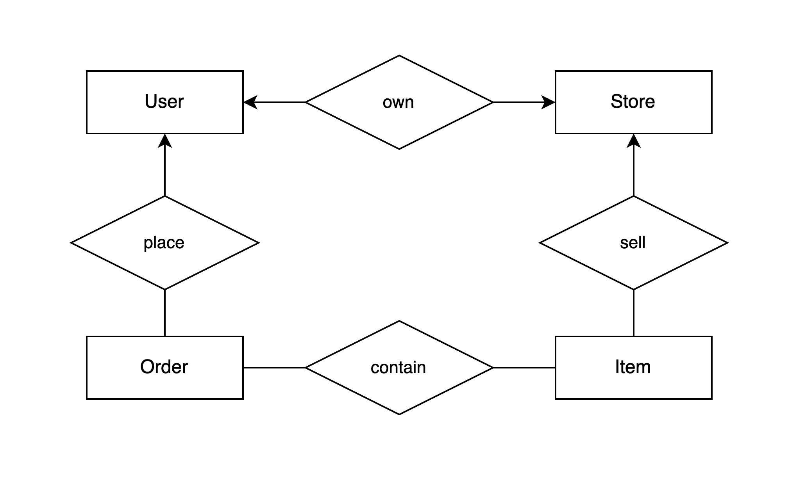

<!-- .slide: class="title" -->

# FastAPI Seminar

## Week 5: Robust Application

By: 이민규

---

# 출석 체크

## https://areyouhere.today/ <!-- .element: style="position: absolute; top: 50%; left: 50%; transform: translate(-50%, -50%)" -->

---

# Table of Contents

 

0. 과제 2, 3 리뷰
1. TDD
2. 로깅과 에러 핸들링
3. Docker와 K8S
4. 모니터링

---

<!-- .slide: class="section-title" data-auto-animate -->

# 0. 과제 2, 3 리뷰

---

<!-- .slide: data-auto-animate -->

# 0. 과제 2 리뷰

## 과제2 - 스펙

 <!-- .element style="width: 55%" -->

- 테이블 설계
- RDS 연결 및 마이그레이션
- 추가 API 9개

---

<!-- .slide: data-auto-animate -->

# 0. 과제 2 리뷰

## 과제2 - Entity Relationship Diagram

 <!-- .element style="width: 60%; position: absolute; right: 0; top: 40%;" -->

- 데이터베이스에 들어가야하는 객체들과 각 객체들의 관계를 표현
- ER Diagram의 3 요소
  - Entity Sets
  - Attributes
  - Relationships

