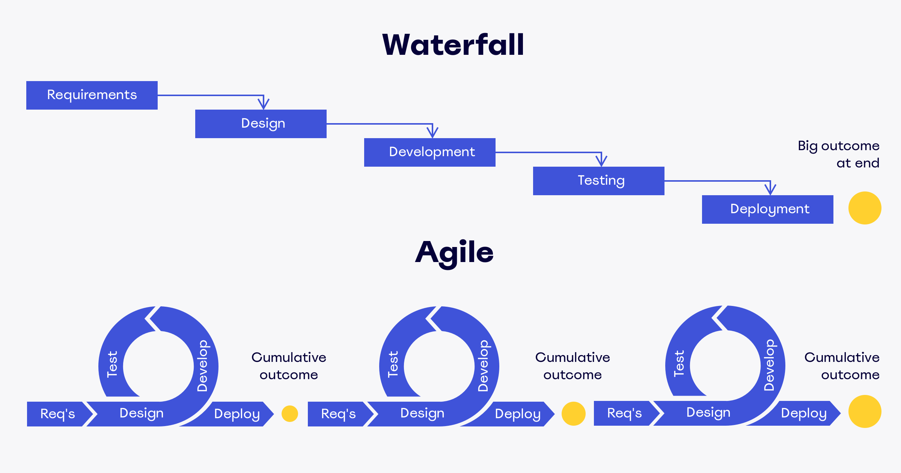

<!-- .slide: class="title" style="background-image: url(./background.png); background-size: 90%; background-repeat: no-repeat; background-position: left bottom" -->

# FastAPI Seminar

## Week 5: 성공적인 토이프로젝트로 가는 길

By: 이민규

---

# 출석 체크

## https://areyouhere.today/ <!-- .element: style="position: absolute; top: 50%; left: 50%; transform: translate(-50%, -50%)" -->

---

# Table of Contents

<br/>

0. 과제 2, 3 리뷰
1. ER Diagram
2. Agile
3. Docker

---

<!-- .slide: class="section-title" data-auto-animate -->

# 0. 과제 2, 3 리뷰

---

<!-- .slide: data-auto-animate -->

# 0. 과제 2, 3 리뷰

## 예시 코드

- 과제 2 정답 코드와 같은 레포의 `feat/async` 브랜치에서 예시 답안 확인 가능
- https://github.com/wafflestudio22-5/fastapi-seminar-2024-assignment-2-fastapi-assignment-1/tree/feat/async

---

<!-- .slide: class="section-title" data-auto-animate -->

# 1. ER Diagram

---

<!-- .slide: data-auto-animate -->

# 1. ER Diagram

## 과제2 스펙

 <!-- .element style="width: 60%; position: absolute; right: 0; top: 25%;" -->

- 테이블 설계
- RDS 연결 및 마이그레이션
- 추가 API 9개

---

<!-- .slide: data-auto-animate -->

# 1. ER Diagram

## Entity Relationship Diagram

 <!-- .element style="width: 60%; position: absolute; right: 0; top: 40%;" -->

- 데이터베이스 내의 관계들을 시각적으로 표현한 것
- ER Diagram의 3 요소
  - Entity Sets
    - 데이터베이스에 표현되는 개념 <!-- .element class="fragment" -->
  - Attributes
    - 엔티티의 하위 속성 <!-- .element class="fragment" -->
  - Relationships
    - 둘 이상의 엔티티 간의 관계 <!-- .element class="fragment" -->

---

<!-- .slide: data-auto-animate -->

# 1. ER Diagram

## Entity Relationship Diagram

<table class="custom">
  <thead>
    <tr class="fragment" data-fragment-index="2">
      <th></th>
      <th>Attribute 1</th>
      <th>Attribute 2</th>
      <th>Attribute 3</th>
      <th>Attribute 4</th>
    </tr>
    <tr>
      <th></th>
      <th>id</th>
      <th>first_name</th>
      <th>last_name</th>
      <th>email</th>
    </tr>
  </thead>
  <tbody>
    <tr>
      <th class="fragment" data-fragment-index="1">Entity 1</th>
      <td>1</td>
      <td>Andrew</td>
      <td>Garfield</td>
      <td>andy@gmail.com</td>
    </tr>
    <tr>
      <th class="fragment" data-fragment-index="1">Entity 2</th>
      <td>2</td>
      <td>Tobias</td>
      <td>Maguire</td>
      <td>tobey@gmail.com</td>
    </tr>
    <tr>
      <th class="fragment" data-fragment-index="1">Entity 3</th>
      <td>3</td>
      <td>Tom</td>
      <td>Holland</td>
      <td>spoiler.man@gmail.com</td>
    </tr>
  </tbody>
</table>

- Entity는 주로 테이블의 행으로 표현 <!-- .element class="fragment" data-fragment-index="1" -->
- Attribute는 주로 테이블의 열로 표현 <!-- .element class="fragment" data-fragment-index="2" -->
- Releationship은 테이블과 테이블 사이의 참조 관계 <!-- .element class="fragment" data-fragment-index="3" -->

---

<!-- .slide: data-auto-animate -->

# 1. ER Diagram

## ER Diagram Cheat Sheet

 <!-- .element style="width: 65%" -->

---

<!-- .slide: data-auto-animate -->

# 1. ER Diagram

## 예제1 - 고객과 주소

 <!-- .element class="fragment" style="position: absolute; top: 40%; width: 50%" -->

---

<!-- .slide: data-auto-animate -->

# 1. ER Diagram

## 예제1 - 고객과 주소

<div class="horizontal">

 <!-- .element style="width: 45%; margin-right: 3em" -->
 <!-- .element class="fragment" style="width: 50%" -->

</div>

---

<!-- .slide: data-auto-animate -->

# 1. ER Diagram

## 예제1 - 고객과 주소

 <!-- .element style="width: 55%; margin-right: 3em" -->

 <!-- .element class="fragment" style="width: 70%" -->

---

<!-- .slide: data-auto-animate -->

# 1. ER Diagram

## 예제2 - 학생과 교수

 <!-- .element style="width: 65%; position: absolute; top: 40%" -->

---

<!-- .slide: data-auto-animate -->

# 1. ER Diagram

## 예제2 - 학생과 교수

 <!-- .element style="width: 95%; position: absolute; top: 40%" -->

---

<!-- .slide: data-auto-animate -->

# 1. ER Diagram

## 예제2 - 학생과 교수

 <!-- .element style="width: 75%; position: absolute; top: 40%" -->

---

<!-- .slide: data-auto-animate -->

# 1. ER Diagram

## 과제2 ER Diagram 을 완성해보자

 <!-- .element class="fragment" style="width: 85%" -->

---

<!-- .slide: class="section-title" data-auto-animate -->

# 2. Agile

---

<!-- .slide: data-auto-animate -->

# 2. Agile

## Waterfall & Agile Methodolgy

 <!-- .element style="width: 90%" -->

---

<!-- .slide: data-auto-animate -->

# 2. Agile

## TDD (Test Driven Development)

 <!-- .element class="fragment" style="position: absolute; top: 30%; right: 0%; width: 35%" data-fragment-index="4" -->

- 짧은 개발 반복 주기(Sprint)의 품질을 보장하기 위한 개발 방법론
- (이론적으로) 모든 코드들은 테스트 가능함
- 특정 기능을 추가할 때, 다음 3가지를 반복
  - 추가되는 기능에 대한 테스트 케이스를 추가 (Red) <!-- .element class="fragment" data-fragment-index="1" -->
  - 테스트 케이스가 성공하도록 기능 추가 (Green) <!-- .element class="fragment" data-fragment-index="2" -->
  - 추가된 기능의 코드를 수정 및 개선 (Refactor) <!-- .element class="fragment" data-fragment-index="3" -->
- 발전된 형태로 BDD, ATDD 등이 있음
- 파이썬에서는 주로 Pytest 사용

---

<!-- .slide: data-auto-animate -->

# 2. Agile

## Pair / Mob Programming

 <!-- .element style="width: 55%" -->

- 둘 이상의 개발자가 함께 모여 하나의 컴퓨터로 개발
- 2가지 핵심 역할
  - Navigator: 자기를 포함한 개발자 그룹이 생각한 해결책을 드라이버에게 지시
  - Driver: 네비게이터의 지시를 코드로 구현

---

<!-- .slide: data-auto-animate -->

# 2. Agile

## MVP (Minimum Viable Product)

 <!-- .element style="width: 55%" -->

- 일단, 동작하게 만들고 보자 - 는 마인드
- 조금씩 차이는 있지만, PoC나 ProtoType 과도 일맥상통함

---

<!-- .slide: data-auto-animate -->

# 2. Agile

## 칸반 보드

 <!-- .element style="width: 50%; position: absolute; top: 25%; right: 0%" -->

<div style="height: 5em"></div>

- 도요타 생산 시스템에서 유래
- 칸반 사용의 목적
  - 업무 흐름을 시각화
  - 동시에 처리 중인 작업의 개수를 제한
  - 업무 분류 및 의존성 관리 용이
- Jira, Trello 등이 유명하지만, Notion 등 무료 솔루션을 사용해도 무방함

---

<!-- .slide: class="section-title" data-auto-animate -->

# 3. Docker

---

<!-- .slide: data-auto-animate -->

# 3. Docker

## 가상 환경의 필요성

 <!-- .element style="width: 80%" -->

- 가상 환경이 필요한 이유
  - 실행 환경이 바뀌면 배포 방법이 바뀔 수 있고 애플리케이션의 정상 동작도 보장되지 않음
  - 즉, 애플리케이션이 OS, 하드웨어 등 물리적인 환경에 의존하길 원치 않음

---

<!-- .slide: data-auto-animate -->

# 3. Docker

## Virtual Machines (Type 2)

 <!-- .element style="width: 70%" -->

- 하드웨어 아키텍처로부터 애플리케이션을 분리하기 위한 전통적인 방법
- 하드웨어 자원을 에뮬레이팅해서 게스트 OS를 실행하기 위한 하이퍼바이저 필요
- 게스트 OS와 호스트 OS가 완벽하게 격리됨
- 운영체제 자체를 에뮬레이팅하므로 오버헤드가 심함

---

<!-- .slide: data-auto-animate -->

# 3. Docker

## Containers

 <!-- .element style="width: 90%" -->

- 현대 웹 개발에서 가장 많이 사용되는 배포 방법
- 호스트 OS와 많은 부분을 공유, OS Specific한 bin/lib 파일들만 분리함
- 하드웨어 자원은 cgroup, namespace 등 리눅스 고유의 기능을 통해 격리됨
- 충분히 높은 수준의 격리를 제공하지만 가상화만큼 완벽하지는 않음
- 운영체제를 에뮬레이팅하는 게 아니므로 오버헤드가 적음

---

<!-- .slide: data-auto-animate -->

# 3. Docker

## OCI (Open Container Initiative)

 <!-- .element style="width: 70%" -->

- 컨테이너 런타임 및 이미지 관련 업계 개방형 표준을 만들기 위한 오픈 소스 단체
- OCI 표준을 준수하는 가장 대중적인 런타임으로 containerd가 있음

---

<!-- .slide: data-auto-animate -->

# 3. Docker

## Docker

 <!-- .element style="width: 50%" -->

- 가장 대중적인 컨테이너 관리 소프트웨어
- 내부적으로 containerd 런타임 사용
- 모든 컨테이너, 이미지들을 관리하는 

---

<!-- .slide: data-auto-animate -->

# 3. Docker

## Docker Architecture

 <!-- .element style="width: 90%" -->

---

<!-- .slide: data-auto-animate -->

# 3. Docker

 <!-- .element style="width: 55%" -->

- 도커 컨테이너는 이미지로부터 생성되며, 이미지는 Base Image 위에 변경 사항이 쌓인 형태
- 한 번 생성된 이미지가 차지하는 공간은 불변하고, 여러 컨테이너가 한 이미지를 공유함
  - 따라서 한 이미지로 여러 컨테이너를 만들어도 용량을 많이 잡아먹지 않음
  - 대신, 이미지를 여러 겹 쌓다보면 크기가 무한정 커질 수 있음


---

<!-- .slide: data-auto-animate -->

# 3. Docker

## Dockerfile

```Dockerfile [1:0|1|2|3|4,9|6,7,13|15]
# syntax=docker/dockerfile:1
FROM python:3.11
WORKDIR /src
RUN pip install poetry

COPY pyproject.toml poetry.lock ./
COPY wapang wapang

RUN poetry install --no-dev

RUN apt update && apt install -y default-libmysqlclient-dev && apt clean

COPY .env.local ./

CMD ["poetry", "run", "uvicorn", "wapang.main:app", "--host", "0.0.0.0", "--port", "8000"]
```